# 1. 朝ラッシュ
## 壁の配置
### wall01
最大人口密度に10*10の壁

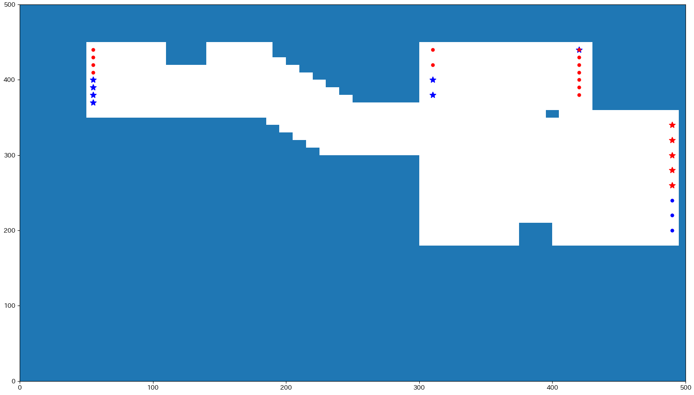
### wall02
最大人口密度に5*20の壁

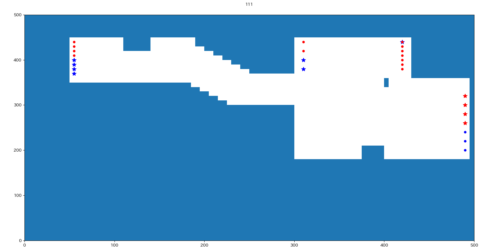
### wall03
wall02を左に10移動させた

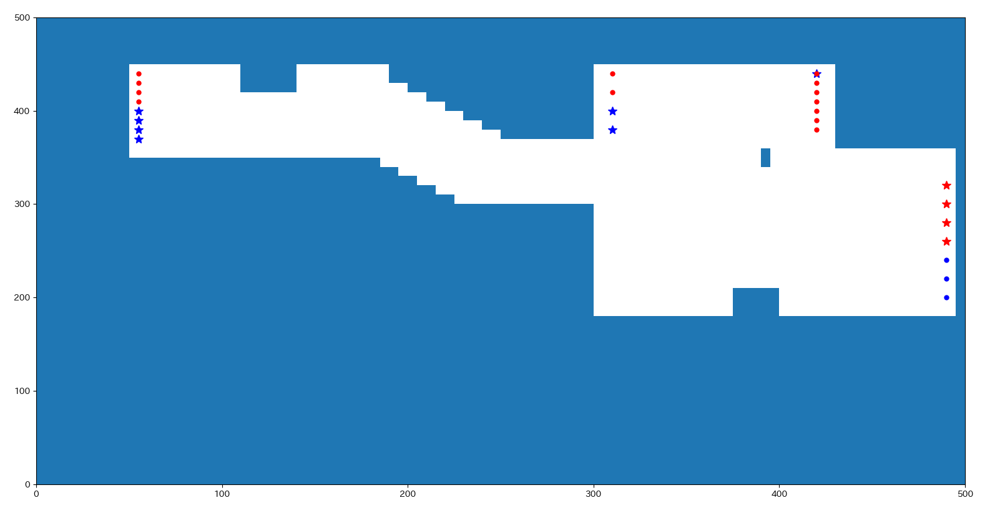
### wall04
最大人口密度に20*5の壁

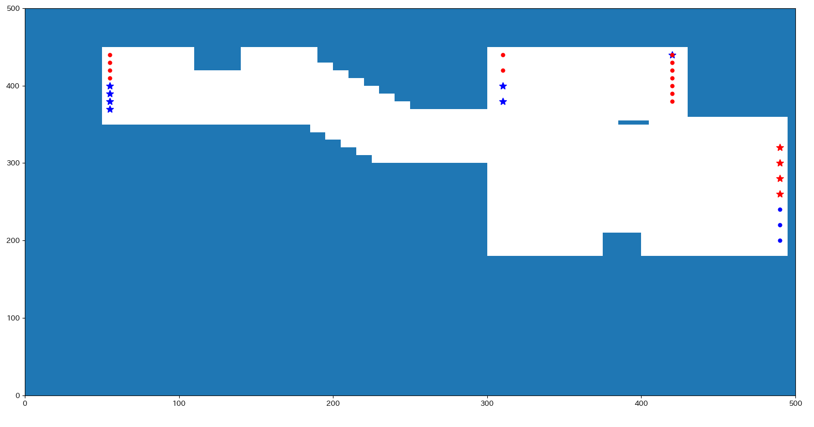
### wall05
wall04を下に-5移動

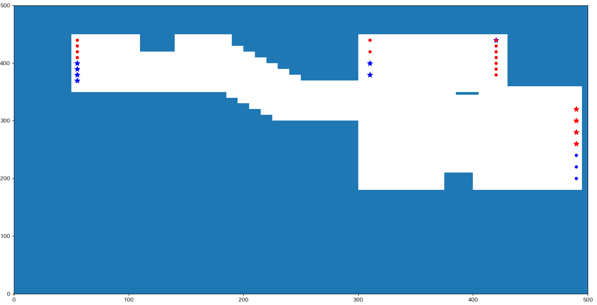

### wall06
20*5の壁
目視で人の流れの境目に配置

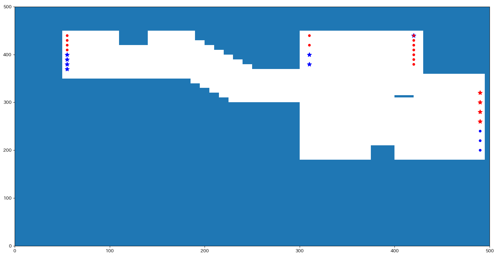

### wall07
20*5
wall06を左に10移動

### wall08
30*5
wall06とwall07をつなげる

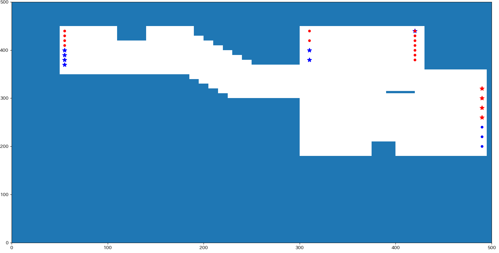

### wall09
淵野辺民とワーカーの改札の境目の延長に壁を配置
20*5

### wall10
wall09をもっと伸ばしてみる
50*5

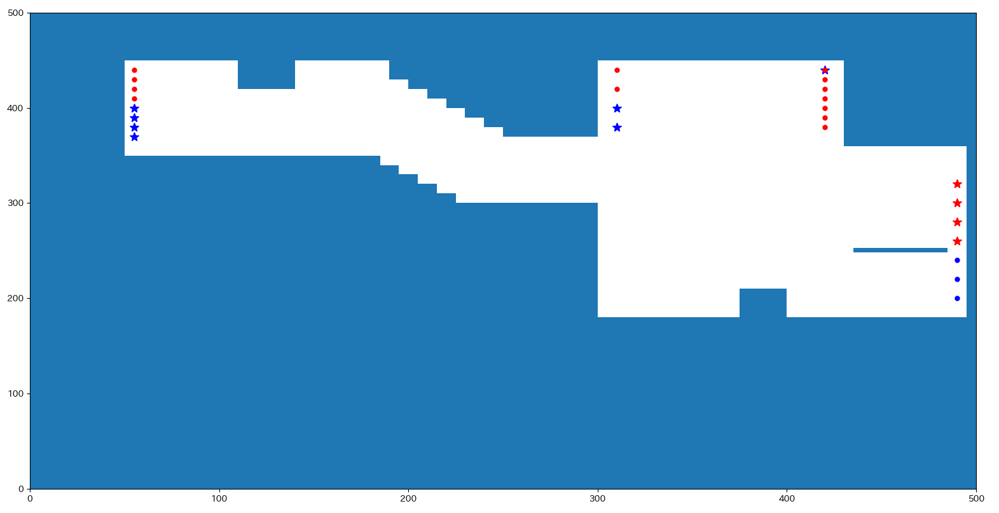

### wall11
wall09をもっともっと伸ばしてみる
100*5

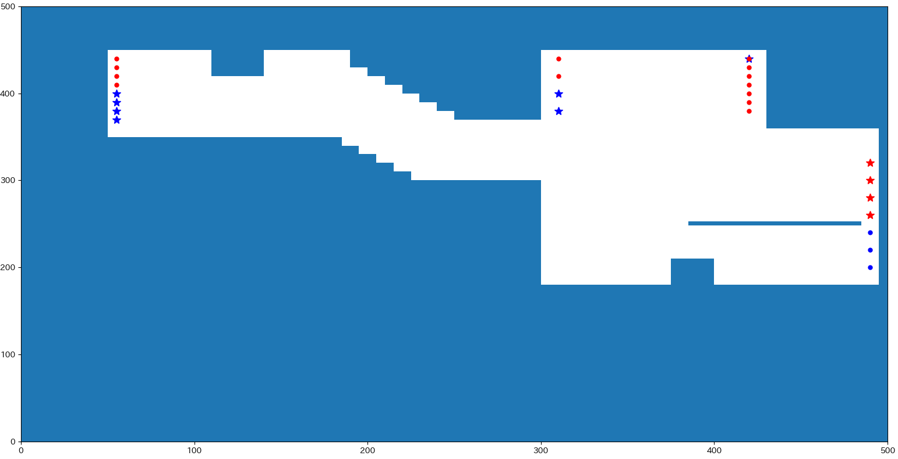

### wall12
同様の考えで位置、長さを少し変更
40*5

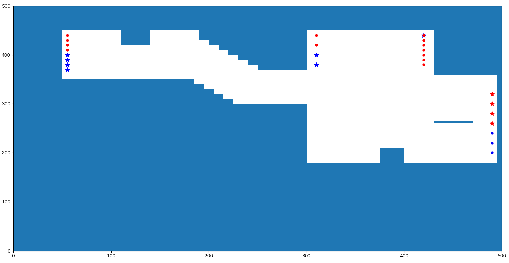

### wall13
奥階段の淵野辺民・ワーカーの分け目に壁
30*5

### wall14
トイレ付近に壁
20*5

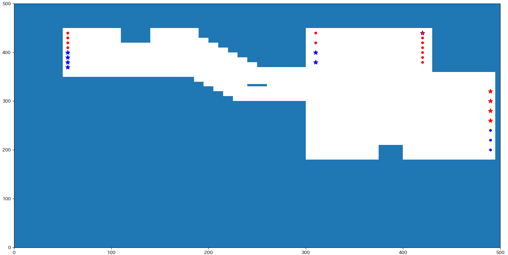

### wall15
淵野辺民奥階段とワーカーが密集する地点に壁
20*20

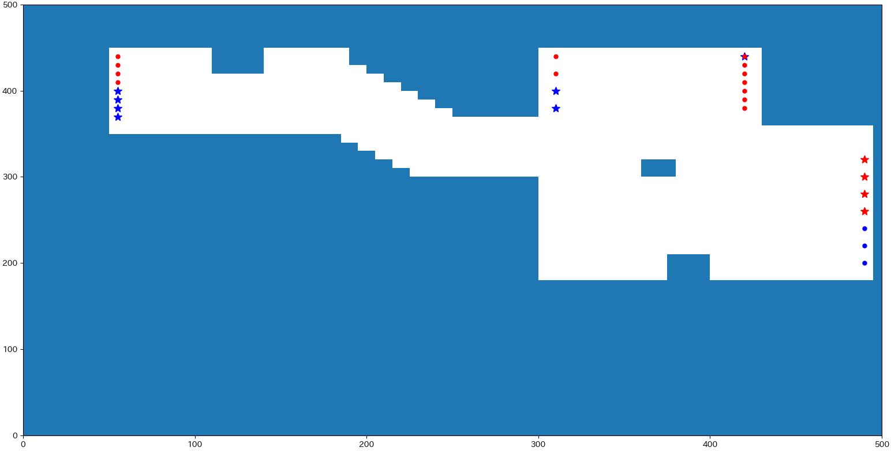

### wall16
wall15の小さい版
10*10

### wall17
エスカレーターから出てくるワーカー、直進できないように配置
5*50

## 制限
### a01
淵野辺民の目的地を奥階段のみに制限

## 改札の改良
### a02
通行可能な改札（default淵野辺民3, ワーカー4）
ワーカーを増やし、淵野辺民を減らす
淵野辺民2, ワーカー5

### a03
淵野辺民1, ワーカー6

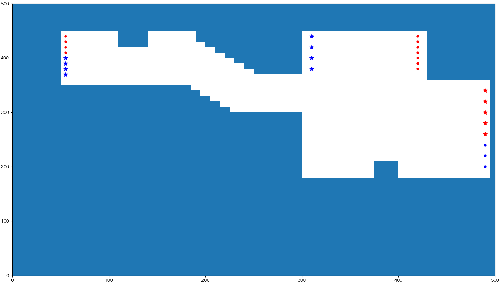

### a04
両方通れる改札を考慮
淵野辺民3, ワーカー5, 下から3つ目が双方向

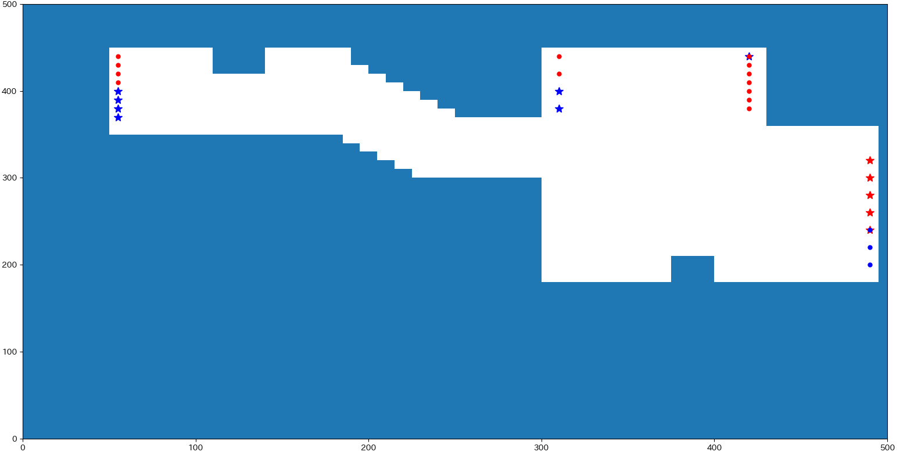

### a05
両方通れる改札を考慮
淵野辺民2, ワーカー6, 下から2つ目が双方向

### a06
両方通れる改札を考慮
淵野辺民3, ワーカー6, 下から2, 3つ目が双方向

### a07
逆に淵野辺民の改札一つ増やしてみる
淵野辺民4, ワーカー3

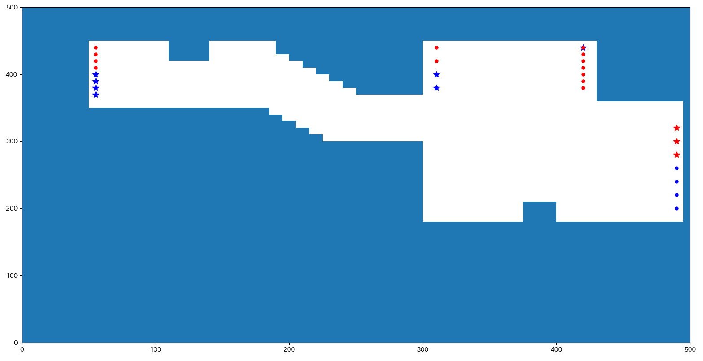

